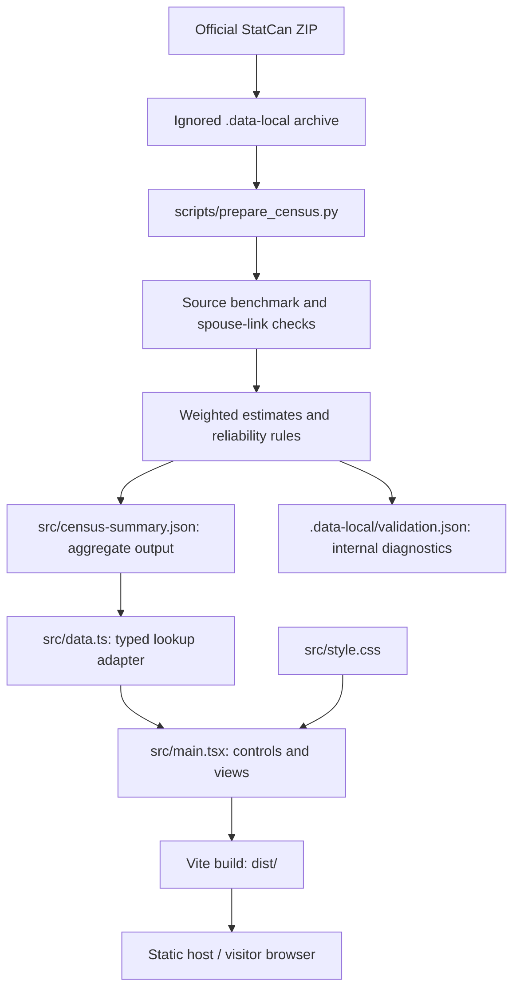

# Architecture and code guide

This is the technical handoff for agents working on **Who married whom? — Canada**. Read [METHODOLOGY.md](METHODOLOGY.md) before changing calculations or the included population.

## Current product and boundaries

A single-page, static React application explores the occupation and gender of spouses of a selected population. It uses real, weighted 2021 Canadian census public-use data, summarized offline.

- Ten broad occupation categories × two published gender categories = 20 selectable profiles.
- Canada total; married couples living together in private households; valid occupation and gender for both spouses.
- A connection diagram, ranked list, full table with uncertainty ranges, coverage explanation, and methodology.
- No backend, database, API credentials, authentication, routing library, or runtime StatCan requests.
- **The second, detailed occupation selector has not been implemented.** The earlier request was interrupted for clarification. The current source has no detailed job-to-job spouse counts. See [DETAILED-OCCUPATION-REQUEST.md](DETAILED-OCCUPATION-REQUEST.md).
- GitHub remote: `git@github.com:jimmod/who-marries-whom.git`; branch `main`. The development history has been pushed. No website deployment was performed. Inspect `git status` and remotes before assuming local changes are published.

## System diagram



The archive is a preparation input, not a website asset. The summary is imported at build time and bundled into the application's JavaScript; it is not fetched as a separate file on each selection. Updating it requires rebuilding and redeploying the website.

## File map

| File | Responsibility |
| --- | --- |
| `index.html` | Root document, metadata, favicon link, and module entry point. |
| `src/main.tsx` | `App`, local UI state, diagram, rankings, full table, source explanations and attribution; mounts through `createRoot` and `StrictMode`. |
| `src/style.css` | Global theme, layout, graph/table styling, responsive breakpoints and accessibility states. |
| `src/data.ts` | Public TypeScript types, profile/category exports and `getSelection`. |
| `src/census-summary.json` | Generated, committed public summary and source provenance. Never manually invent or tune estimates here. |
| `scripts/prepare_census.py` | Download option, archive parsing, spouse linkage, aggregation, uncertainty, reliability filtering, validation and exports. Python standard library only. |
| `tests/test_census.py` | Estimator example from the official guide, small-cell publication rules, code mapping, and forbidden raw fields in output. |
| `tests/data.test.mjs` | Runs the actual TypeScript adapter via TypeScript transpilation; validates all 20 profiles and unsupported selection handling. |
| `public/favicon.svg` | Static site icon. |
| `package.json`, `package-lock.json` | npm scripts and locked dependencies; preserve the lockfile. |
| `tsconfig.json` | Strict TypeScript checking, bundler module resolution and React JSX. |
| `.data-local/` | Ignored archive, optional source guide and local audit report; not needed to build the existing website. |
| `dist/` | Ignored production build; the only directory to upload to a static host. |

## Runtime flow and UI state

`App` maintains four pieces of state:

| State | Meaning | Initial value |
| --- | --- | --- |
| `noc` | Broad **NOC** category, a string from `"0"` to `"9"`. | `"4"` (education, law and social services) |
| `gender` | Source gender code, `"1"` or `"2"`. | `"1"` (Women+) |
| `view` | `connections` or `table`. | `connections` |
| `active` | Highlighted target profile ID, or `null`. | `null` |

Changing either selector clears the highlighted connection while preserving the selected view. `getSelection(gender, noc)` resolves the source profile, gets its precomputed selection, and joins every result's target ID to its display labels. It throws for unsupported source categories or missing target references; there is currently no error boundary or network-loading state because this is a fixed, build-time dataset.

The diagram and ranking use the first six reportable rows. The diagram's remainder adds the other reportable rows and any publishable pooled estimate. **It does not compute `100 - visible shares`**, because an unreportable residual must not silently reappear in the visualization. The full list shows every reportable row and the pooled estimate when available. `hasUnreportedRemainder` controls the explanatory omission notice.

Hovering, focusing or clicking a ranking row highlights its graph connection. The graph is a fixed SVG layout, not a force simulation. `wrap` splits long category labels; `fmt` displays one decimal place; `interval` formats the uncertainty range. Percentages are already on a 0–100 scale.

The methodology section uses native `details` elements. Native selects and buttons provide keyboard interaction. On narrow screens, the diagram and full table scroll horizontally instead of shrinking every label; the ranked list fits the viewport. Fonts come from Google Fonts with local fallbacks. UI state is not persisted to storage or encoded in the URL; `#methodology` is only an anchor.

## Branding

The display name is **Who married whom? — Canada**. Keep the header, footer, browser title and documentation consistent. The repository name remains `who-marries-whom`; the local folder and npm package retain their existing names.

The header icon is an inline SVG of interlocking wedding rings in `src/main.tsx`, with a Canadian flag emoji badge. `.marriage-mark` and `.flag-badge` in `src/style.css` control sizing and placement. The badge surrounding is intentionally transparent with no border; the white area inside the flag is part of the flag itself. Emoji appearance depends on the operating system. The decorative mark is hidden from assistive technology, while the home link provides the full accessible name.

`public/favicon.svg` uses a simplified rings-only mark for legibility at small sizes. Update both SVGs deliberately when changing the brand; they are separate assets. Preserve the mobile sizing rules when adjusting the header.

## Public data contract

The JSON has three top-level fields: `metadata`, `profiles`, and `selections`.

### Profiles and identifiers

Each profile contains `id`, `gender`, `genderCode`, `occupation`, `fullOccupation`, and `noc`.

**Two different occupation code systems coexist:**

- The input's `NOC21` file codes are **1–10**.
- The actual NOC broad category codes are **0–9**.
- `id` is `GENDER:NOC21` using the input file code, while `noc` is the actual broad category.
- Example: profile `"1:5"` is Women+ in broad NOC `"4"`, education/law/social services.

Keep codes as strings. Do not derive a profile ID by concatenating the UI's gender and `noc` without applying the mapping. `occupations` in the adapter selects the Women+ profiles only to obtain one copy of each occupation label; it is not a restriction of the occupation menu to women.

### Selection values

| Field | Meaning |
| --- | --- |
| `rows` | Descending reportable combinations; each has `target`, `percent`, `lower`, `upper`, and `quality`. |
| `pooled` | One estimate for combined combinations that could not be shown individually, or `null`. No constituent values are exposed. |
| `hasUnreportedRemainder` | True if even the pooled residual failed the display policy. |
| `includedPercent` | Weighted included people divided by all married people with the selected source profile in the file. |
| `linkedPercent` | Weighted people with an identifiable married spouse divided by that same all-married source-profile total, before requiring the spouse's usable occupation/gender. |

`lower` and `upper` are approximate 95% limits, clipped to 0–100. `quality` is `standard` or `caution`; the current TypeScript definition accepts a string. A missing row is **not zero**. Published shares plus a publishable residual should sum to 100 within export rounding; otherwise their sum is below 100. Do not renormalize only the displayed rows.

Metadata records source URLs, reference year, corrected source version, archive SHA-256, generation timestamp, population definition, reliability policy and attribution. The generation timestamp is not the census year. There is currently no schema-version field; add one when introducing incompatible formats or multiple datasets.

## Preparation code

| Symbol | Purpose |
| --- | --- |
| `URL`, `CATALOGUE` | Fixed official V2 source references. |
| `NAMES`, `GENDERS` | Verified source-category mappings and short/full labels. |
| `profile_id(person)` | Returns a usable profile key or `None` for unavailable/inapplicable values. |
| `empty()` | Creates an internal bucket with a sample count and 17 accumulated weights. |
| `add(bucket, person)` | Adds one person's point weight plus 16 replicate weights. |
| `merge(buckets)` | Combines buckets before estimating a total or residual. |
| `estimate(numerator, denominator)` | Weighted percentage, replicate-based SE/CV, approximate interval and display eligibility. |
| `public_estimate(result)` | Removes internal CV/eligibility fields and rounds exported floating-point estimates to six decimals. |
| `prepare(archive, output, audit_path)` | Orchestrates parsing, benchmark checks, spouse matching, profile estimates and file output. |

The script streams the CSV from the ZIP, accumulates source benchmarks, retains partner records grouped by `(HH_ID, CF_ID)`, and tracks all married people with valid source profiles for coverage. It validates matching family roles and married status before contributing each spouse in both directions. Only couples with valid profiles for both spouses contribute to the occupation distribution.

Every person uses their own `WEIGHT` and replicate weights. A couple with identical source/target profiles contributes two people, not one. Reciprocal point-count equality is asserted for this file because these spouses share household weights; reciprocal **percentages need not match** because the source populations differ.

Uncertainty uses the 16 replicate ratios and `sqrt(sum((replicate - replicate_mean)^2) / 35)`. The factor 35 is specific to the guide's method. Individual cells need at least 30 sample people and CV ≤ 1/3; CV > 0.165 is marked caution. Each source denominator must have at least 100 sample people. These are application reliability policies, not claims of StatCan approval. See the methodology for the full statistical contract.

## Development, validation and publishing

Run commands from the repository root:

```sh
npm ci
npm run dev
npm test
npm run build
```

The dev server binds to `127.0.0.1`; Vite prints the port. Node 22.12+ is recommended. Python 3 is needed for the tests and preparation, but not to build an already generated summary.

To regenerate from the cached official source:

```sh
python3 scripts/prepare_census.py --download
```

`--download` fetches only if the archive is missing; it does not refresh an existing archive. `--archive`, `--output`, and `--audit` override paths. No authentication is required. The script expects `data_donnees_2021_hier_v2.csv` inside the ZIP and hard-coded V2 benchmarks. If those checks fail, investigate the source/version instead of weakening them. Do not use `python -O`: it disables the script's assertions.

After regeneration, review the summary and ignored audit report, run tests, and rebuild. The timestamp changes on each run; compare content separately from `generatedAt` when checking reproducibility. The SHA records the downloaded archive but is not a pinned allowlist verification.

Only deploy `dist/`. The host requires no census service or database connection. Do not deploy the repository root or `.data-local/`. For a host serving from a subpath rather than the domain root, review Vite's `base`, the root link, and favicon path before publishing.

Tests cover statistical and data-contract behavior, not browser layout or end-to-end clicks. Browser inspection was blocked by the environment's security-policy verification during initial development; no visual QA success should be inferred from build success. Check both views, all selectors, keyboard navigation, and narrow-screen overflow when browser access is available.

## Change guide for future agents

- **Layout or copy:** start in `src/main.tsx` and `src/style.css`. Keep the source scope and denominators explicit. The stylesheet has accumulated overrides; later rules win, so inspect the full cascade before adding another override.
- **Occupation labels:** change `NAMES` in the generator and regenerate. Preserve code meanings and full official names.
- **Statistical logic or reliability:** update the pipeline, methodology, UI explanations and tests together; inspect benchmark and residual behavior after regeneration.
- **Detailed occupation selector:** obtain real detailed joint counts first for functioning statistics. A taxonomy-only selector can describe occupations but must explicitly show unavailable results, never reuse a broad group's percentage under a specific job title. This feature is currently absent.
- **Province, age or common-law filters:** require corresponding precomputed populations/denominators, reliability checks, schema changes and matching UI. The current summary cannot supply these by filtering existing rows.
- **New census release:** verify identifiers, occupation code mapping, gender categories, weights, variance method, benchmarks and licence; do not assume compatibility.
- **Additional datasets:** keep their provenance, population definitions and classification versions separate. Never merge percentages with incompatible denominators.

## Development history

The initial history was reconstructed from saved snapshots in logical order, not backdated:

1. `4407c50` — initial React prototype with synthetic data.
2. `cda5537` — corrected demo assumptions and readability.
3. `5e15581` — replaced all synthetic results with real census summaries, pipeline and tests.
4. `4eddd6f` — recorded requirements for obtaining detailed occupation pairings.

Use `git log` for subsequent changes. The synthetic assumptions belong only to historical commits and must never be reintroduced into the real dataset.
